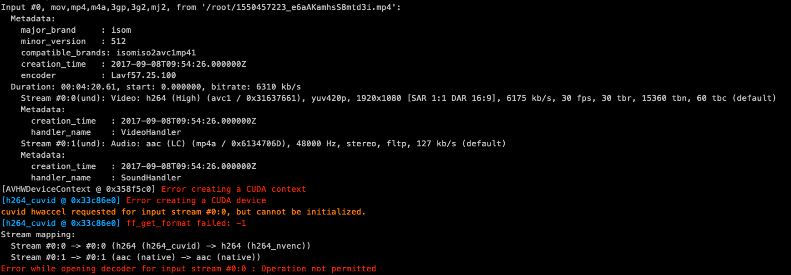

# FFmpeg-GPU

[](https://travis-ci.com/iliul/ffmpeg-gpu)

FFmpeg with NVIDIA P4 GPU Driver Support, 3rd library :

- libx264
- libx265
- libfdk_acc
- libmp3lame
- libops
- libogg
- libvorbis
- libvpx

## Prepare work directory

```
echo "PREPARE WORK ENV ..."
sudo mkdir -p /opt/ffmpeg_build
sudo mkdir -p /opt/bin
```

## Install CUDA

Note: Use CUDA 9.2 with FFmpeg-n4.0, Version 10.0 is incompatible.

```
echo "START INSTALLING CUDA TOOLKITS ..."
sudo dpkg -i cuda-repo/cuda-repo-ubuntu1604_9.2.148-1_amd64.deb
sudo apt-key adv --keyserver hkp://keyserver.ubuntu.com:80 --recv F60F4B3D7FA2AF80
sudo apt-get update -y
sudo apt-get install cuda-9-2 -y
```

### Install ASSEMBLY COMPILER

```
echo "START INSTALLING ASSEMBLY COMPILER ..."
pushd nasm-2.13.02
sudo ./autogen.sh
sudo ./configure --prefix="/opt/ffmpeg_build" --bindir="/opt/bin"
sudo make && sudo make install && popd;

pushd yasm-1.3.0
sudo ./configure --prefix="/opt/ffmpeg_build" --bindir="/opt/bin"
sudo make && sudo make install && popd;
```

### Install X264

```
echo "START INSTALLING 3RD LIBRARIES ..."
echo "INSTALLING X264 ..."
pushd x264
sudo PKG_CONFIG_PATH="/opt/ffmpeg_build/lib/pkgconfig" ./configure --prefix="/opt/ffmpeg_build" --bindir="/opt/bin" --enable-static
sudo make && sudo make install && popd;
```


### Install X265

```
echo "INSTALLING X265 ..."
pushd x265/build/linux
sudo cmake -G "Unix Makefiles" -DCMAKE_INSTALL_PREFIX="/opt/ffmpeg_build" -DENABLE_SHARED:bool=off ../../source
sudo make && sudo make install && popd;
```


### Install fdk-aac

```
echo "INSTALLING FDK-AAC ..."
pushd fdk-aac
sudo autoreconf -fiv
sudo ./configure --prefix="/opt/ffmpeg_build" --disable-shared
sudo make && sudo make install && popd;
```

### Install lame-3.100

```
echo "INSTALLING LAME ..."
pushd lame-3.100
sudo ./configure --prefix="/opt/ffmpeg_build" --bindir="/opt/bin" --disable-shared --enable-nasm
sudo make && sudo make install && popd;
```

### Install opus-1.2.1

```
echo "INSTALLING OPUS ..."
pushd opus-1.2.1
sudo ./configure --prefix="/opt/ffmpeg_build" --disable-shared
sudo make && sudo make install && popd;
```

### Install libogg-1.3.3

```
echo "INSTALLING LIBOGG ..."
pushd libogg-1.3.3
sudo ./configure --prefix="/opt/ffmpeg_build" --disable-shared
sudo make && sudo make install && popd;
```

### Install libvorbis-1.3.5

```
echo "INSTALLING LIBVORBIS ..."
pushd libvorbis-1.3.5
sudo ./configure --prefix="/opt/ffmpeg_build" --with-ogg="/opt/ffmpeg_build" --disable-shared
sudo make && sudo make install && popd;
```

### Install libvpx

```
echo "INSTALLING LIBVPX ..."
pushd libvpx
sudo ./configure --prefix="/opt/ffmpeg_build" --disable-examples --disable-unit-tests --enable-vp9-highbitdepth --as=yasm
sudo make && sudo make install && popd;
```

## Install nv-codec-headers

```
echo "INSTALLING NV-CODEC-HEADERS ..."
pushd nv-codec-headers
sudo make PREFIX="/opt/ffmpeg_build" BINDDIR="/opt/bin"
sudo make install PREFIX="/opt/ffmpeg_build" BINDDIR="/opt/bin" && popd;
```

## Compiling ffmpeg

```
cd ffmpeg-n4.0
PATH="/opt/bin:$PATH" PKG_CONFIG_PATH="/opt/ffmpeg_build/lib/pkgconfig" ./configure \
--prefix="/opt/ffmpeg_build" \
--pkg-config-flags="--static" \
--extra-cflags="-I/opt/ffmpeg_build/include -I/usr/local/cuda/include" \
--extra-ldflags="-L/opt/ffmpeg_build/lib -L/usr/local/cuda/lib64" \
--extra-libs=-lpthread \
--extra-libs=-lm \
--bindir="/opt/bin" \
--enable-gpl \
--enable-libfdk_aac \
--enable-libfreetype \
--enable-libmp3lame \
--enable-libopus \
--enable-libvorbis \
--enable-libvpx \
--enable-libx264 \
--enable-libx265 \
--enable-nonfree \
--enable-cuda \
--enable-cuvid \
--enable-nvenc \
--enable-libnpp
make -j8
make install
```

## Verify Hardware Acceleration Method

```
~/work/cuda-9.2# ffmpeg-gpu -hwaccels
ffmpeg version 3.3.8 Copyright (c) 2000-2018 the FFmpeg developers
  built with gcc 5.4.0 (Ubuntu 5.4.0-6ubuntu1~16.04.11) 20160609
  configuration: --prefix=/opt/ffmpeg_build --pkg-config-flags=--static --extra-cflags='-I/opt/ffmpeg_build/include -I/usr/local/cuda/include' --extra-ldflags='-L/opt/ffmpeg_build/lib -L/usr/local/cuda/lib64' --extra-libs=-lpthread --extra-libs=-lm --bindir=/opt/bin --enable-gpl --enable-libfdk_aac --enable-libfreetype --enable-libmp3lame --enable-libopus --enable-libvorbis --enable-libvpx --enable-libx264 --enable-libx265 --enable-nonfree --enable-cuda --enable-cuvid --enable-nvenc --enable-libnpp
  libavutil      55. 58.100 / 55. 58.100
  libavcodec     57. 89.100 / 57. 89.100
  libavformat    57. 71.100 / 57. 71.100
  libavdevice    57.  6.100 / 57.  6.100
  libavfilter     6. 82.100 /  6. 82.100
  libswscale      4.  6.100 /  4.  6.100
  libswresample   2.  7.100 /  2.  7.100
  libpostproc    54.  5.100 / 54.  5.100
Hardware acceleration methods:
cuvid
```

cuvid gpu codec

```
~/work/cuda-9.2# ./ffmpeg -codecs | grep cuvid
DEV.LS h264                 H.264 / AVC / MPEG-4 AVC / MPEG-4 part 10 (decoders: h264 h264_cuvid ) (encoders: libx264 libx264rgb h264_nvenc nvenc nvenc_h264 )
DEV.L. hevc                 H.265 / HEVC (High Efficiency Video Coding) (decoders: hevc hevc_cuvid ) (encoders: libx265 nvenc_hevc hevc_nvenc )
DEVIL. mjpeg                Motion JPEG (decoders: mjpeg mjpeg_cuvid )
DEV.L. mpeg1video           MPEG-1 video (decoders: mpeg1video mpeg1_cuvid )
DEV.L. mpeg2video           MPEG-2 video (decoders: mpeg2video mpegvideo mpeg2_cuvid )
DEV.L. mpeg4                MPEG-4 part 2 (decoders: mpeg4 mpeg4_cuvid )
D.V.L. vc1                  SMPTE VC-1 (decoders: vc1 vc1_cuvid )
DEV.L. vp8                  On2 VP8 (decoders: vp8 libvpx vp8_cuvid ) (encoders: libvpx )
DEV.L. vp9                  Google VP9 (decoders: vp9 libvpx-vp9 vp9_cuvid ) (encoders: libvpx-vp9 )
```

## Run FFmpeg on GPU

Use `h264_cuvid` and `h264_nvenc` to decode/encode video, Hareware cuvid

```
ffmpeg -threads 5 -v error -hwaccel cuvid -c:v h264_cuvid -i /tmp/1550461275_KSTztFoTOwBGx05b.mp4 -strict -2 -c:v h264_nvenc -acodec copy -b:v 9000k -vf scale_npp=3840:1920 -f mp4 -movflags faststart -y /tmp/gpu-out.mp4
```

or specified hardware device only use GPU 0

```
ffmpeg -threads 5 -v error -hwaccel cuvid -hwaccel_device 0 -c:v h264_cuvid -i /tmp/1550461275_KSTztFoTOwBGx05b.mp4 -strict -2 -c:v h264_nvenc -acodec copy -b:v 9000k -vf scale_npp=3840:1920 -f mp4 -movflags faststart -y /tmp/gpu-out.mp4
```

## Addenda

More information from nvidia-smi:

1, Error creating a CUDA context



2, Normal

```
Fri Feb 22 11:31:46 2019
+-----------------------------------------------------------------------------+
| NVIDIA-SMI 410.79       Driver Version: 410.79       CUDA Version: 10.0     |
|-------------------------------+----------------------+----------------------+
| GPU  Name        Persistence-M| Bus-Id        Disp.A | Volatile Uncorr. ECC |
| Fan  Temp  Perf  Pwr:Usage/Cap|         Memory-Usage | GPU-Util  Compute M. |
|===============================+======================+======================|
|   0  Tesla P4            Off  | 00000000:04:00.0 Off |                    0 |
| N/A   47C    P0    29W /  75W |    779MiB /  7611MiB |     17%      Default |
+-------------------------------+----------------------+----------------------+

+-----------------------------------------------------------------------------+
| Processes:                                                       GPU Memory |
|  GPU       PID   Type   Process name                             Usage      |
|=============================================================================|
|    0    298145      C   ffmpeg                                       769MiB |
+-----------------------------------------------------------------------------+
```

